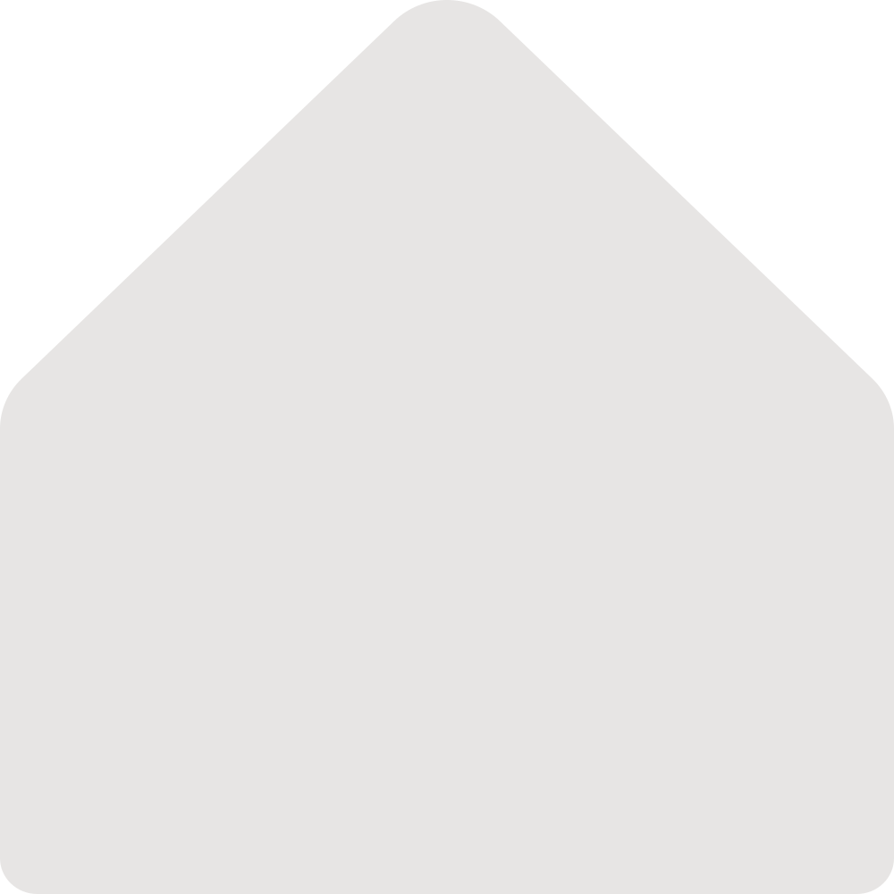

<div align="center">



# townbase

townbase is a Bun-powered Next.js workspace app prototype for teams that want a single place to manage work, write docs, and review analytics.

</div>

Current routes in `apps/web`:

- `/` - landing page for the workspace product
- `/sign-in` - sign-in screen placeholder
- `/dashboard` - dashboard placeholder

## Stack

- Bun for package management and the production runtime
- Next.js App Router for the web application
- Turborepo for the monorepo workflow
- Docker for production-style local runs

## Run with Docker

### Prerequisites

- Docker installed and running

### Build the image

```bash
docker build -t townbase-web .
```

### Start the container

```bash
docker run --rm -p 3000:3000 townbase-web
```

Open `http://localhost:3000`.

## Run with Docker Compose

```bash
docker compose up --build
```

Stop it with:

```bash
docker compose down
```

## Run locally

### Prerequisites

- Bun `1.3.10`

### Install dependencies

```bash
bun install
```

### Start the app in development

```bash
bun run dev
```

Open `http://localhost:3000`.

### Useful checks

```bash
bun run lint
bun run format
bun run check-types
```

## Notes

- The production image uses `oven/bun:1.3.10-alpine` as the runtime.
- The Next.js app is built in standalone mode so the final image stays small.
- The build stage uses Node.js for compatibility, while the final server runs on Bun.
